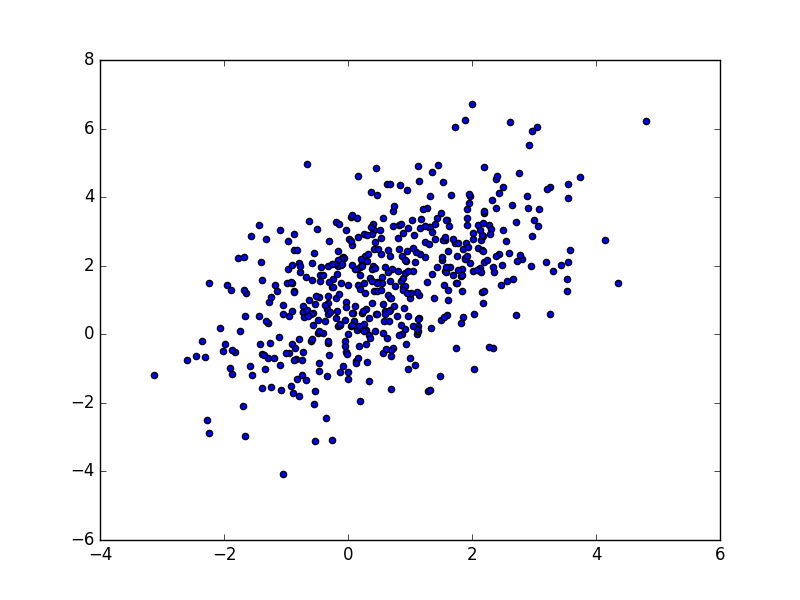
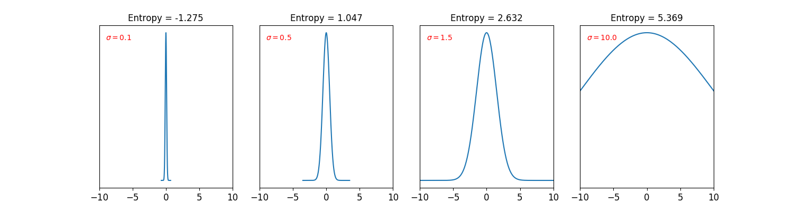

# Reminders of relevant math

Data mining or machine learning or what you like to call it, does require a fair bit of mathematics as underpinning. While we will not develop our own methods, it is important that you have the basics in place since there will be references to these results during the lectures and during the occasional derivation.

This brief document will not replace a text book in linear algebra or numerical analysis of course, but it should suffice for your needs if all you need is a refresher.

There will also be frequent examples from the Python numerical library `numpy` and all examples below will assume that you have imported `numpy` already. In practice the way I start my session is:
```
> ipython
Python 2.7.12 |Anaconda 2.1.0 (x86_64)| (default, Jul  2 2016, 17:43:17) 
Type "copyright", "credits" or "license" for more information.

IPython 4.2.0 -- An enhanced Interactive Python.
?         -> Introduction and overview of IPython's features.
%quickref -> Quick reference.
help      -> Python's own help system.
object?   -> Details about 'object', use 'object??' for extra details.

In [1]: import numpy as np

```

# Linear algebra

A key foundation stone of machine learning is linear algebra, the study of linear equations and their transformations. Many of the methods we study here are conveniently formulated using the language of linear algebra and a good foundation in this area is very useful.

Linear algebra typically deals with various dimensional structures. I will refer to scalars, vectors and matrices as 0-dimensional, 1-dimensional and 2-dimensional structures with higher dimensional structures referred to as tensors but there is no need for those here. The notation I will adopt is to use lower-case math italic for scalars: $x$, while vectors will use boldface: $\mathbf{x}$. For matrices I will use an uppercase letter in bold: $\mathbf{A}$. It is convenient to switch between denoting the structures this way and using indices. So the matrix $\mathbf{A}$ has elements $A_{i, j}$, where $1\le i\le n$ and $1 \le j \le m$ if $\mathbf{A}$ is an $n\times m$ matrix. 
 
### The transpose of a matrix

This is denoted as $\mathbf{A}^T$ and is defined in coordinates as \\[ \left(\mathbf{A}^{T}\right)_{i, j} = {A}\_{j, i}\\] 

The transpose of a vector is also defined and an $N$ element vector is then transformed into an $1\times N$ element matrix, although it is more common to call it a column vector (assuming that the first index is the row).

Note that in `numpy` the `transpose` function is somewhat different - it just reverses the axes. This gives unexpected results for vectors. See for instance this code snippet:

```
In [2]: a = np.array([1,2,3])
In [3]: print a.shape, np.transpose(a).shape
(3,) (3,)
```
so as you can see, the shape has not changed. In general this is not a problem in `numpy` but if you want to follow mathematical notation you can use `np.matrix` instead of `np.array`. For general use it is usually best to use `np.array` however, and instead keep an eye out for this potential gotcha.  Note also that `a.T` is a shorthand for `np.transpose(a)` and I will usually use this.


### Index games and matrix multiplication

In the machine learning literature it is common to use simple short-cuts such as
$$M_{i,j} = A_{i,j} + b_{j}$$
to mean that we add $b_j$ to $A_{i,j}$ for all $i$. I will also use this slightly lazy notation - keep in mind that we are *not* using Einstein's summation convention in this area btw.

**Matrix multiplication** is an important ingredient of linear algebra and the matrix product is defined as
$$\mathbf{C} = \mathbf{A}\mathbf{B}$$
which in index notation is
$$C_{i,j} = \sum_k A_{i,k} B_{k, j}$$

In `numpy` we can carry out a matrix product as follows
```
In [4]: A = np.array([[1, 2, 5], [4, 3,6], [1, 8, 9]])
In [5]: B = np.array([[5,3,2], [6,2,1], [0, 3,1]])
In [6]: C = np.matmul(A, B)
Out[6]: 
array([[19, 35, 61],
       [15, 26, 51],
       [13, 17, 27]])
```
The same result can be had (for 2D variables) using `np.dot` instead of `np.matmul`.

**Try using python:** Check whether the matrix product is commutative and check the rule for the tranpose of a product:
$(\mathbf{A}\mathbf{B})^T = \mathbf{B}^T\mathbf{A}^T$.


### Linear equations

A linear equation in matrix/vector notation is
$$\mathbf{A}\mathbf{x} = \mathbf{b}$$.
**Do:** Write this out for a $2\times 2$ matrix $\mathbf{A}$.

We can solve this by introducing the concept of the inverse of a matrix, $\mathbf{A}^{-1}$, where
$$\mathbf{A}^{-1} \mathbf{A} = \mathbf{I}$$,where $ \mathbf{I}$ is the unit matrix which has 1's on the diagonal and 0's everywhere else.

In `numpy` we get the unit matrix by calling `np.diag`:
```
In [7]: np.diag([1,1,1])
Out[7]: 
array([[1, 0, 0],
       [0, 1, 0],
       [0, 0, 1]])
```
and we can invert the matrix using the `np.linalg.inv` function:
```
In [8]: Ainv = np.linalg.inv(A)

In [9]: np.matmul(Ainv, A)
Out[9]: 
array([[ 1.,  0.,  0.],
       [ 0.,  1.,  0.],
       [ 0.,  0.,  1.]])
```
Note that here we use the `np.linalg` library - this contains the core linear algebra tools in `numpy` and is often the place to look for relevant functions.

We can now solve the linear equations by calculating
$$\mathbf{x} = \mathbf{A}^{-1} \mathbf{b}$$. In `numpy` with $\mathbf{b}=[0,  4, 1.5]$ we get
```
In [10]: b = np.array([0, 4, 1.5])

In [11]: np.matmul(Ainv, b)
Out[11]: array([ 1.3046875,  0.578125 , -0.4921875])
```

but note that this is in general *not* the preferred way to solve a linear set of equations numerically due to the possibility to instabilities etc. It also only works when $\mathbf{A}$ is square (otherwise the inverse is not defined). The inverse also does not exist for a square matrix if the [**determinant**](https://en.wikipedia.org/wiki/Determinant) is non-zero. The precise formula for calculation of a determinant is not relevant here (see the Wikipedia link), but it is useful to know that it is calculated in `numpy` as `np.linalg.det(A)`. 

When you work with `numpy` it is typically better to use the `np.linalg.solve` function to solve a linear system involving square matrices instead of calculating the inverse yourself:
```
In [12]: np.linalg.solve(A, b)
Out[12]: array([ 1.3046875,  0.578125 , -0.4921875])
```

For non-square matrices there are ways to define equivalents to inverses (the Moore-Penrose pseudo-inverse is one) but we will not disucss this in general. These situations include cases where the system is [*under-determined*](https://en.wikipedia.org/wiki/Underdetermined_system) - in this case there are fewer equations/constraints than there are variables. In this case there are either no solutions, or infinitely many. This might seem rather useless for us, but if there are additional constraints on the solution (e.g. the length of the vector $\mathbf{x}$ should be minimal) then these systems might still have a unique solution.

The contrasting situation is when there are more equations than unknowns. This is the [*over-determined*](https://en.wikipedia.org/wiki/Overdetermined_system) case. In this case you normally have no exact solutions, but it might still be interesting to try to find *approximate* solutions. In this case you try to minimise $|\mathbf{A}\mathbf{x} - \mathbf{b}|$ where the $|\cdot|$ operator is defined below.

### The length of vectors

We frequenctly want to have a notation for the length of vectors. In linear algebra this is usually called the norm of the vector and the most common is the $L_p$ norm. This is defined through
$$L_p : ||x||_p = \left(\sum\_i \left|x\_i\right|^p\right)^{1/p} $$,

which clearly is a metric on this vector space. The most commonly used values for $p$ is 1 and 2. The case of $p=2$ is the Euclidian norm, the normal distance concept in Euclidian space. In addition to these two values, the $p=\infty$ case is also commonly seen in Machine Learning. This is
$$L_\infty = \max \left(|x_i|\right)$$

I will often be lazy and write $|\mathbf{x}|$ to denote the length of a vector and indicate in the text what kind of norm I am using. However to be correct one should write $||\mathbf{x}||_2$ to indicate the Euclidian norm, $||\mathbf{x}|| = \sqrt{x_1^2 + x_2^2}$ in 2D for instance.

Defining the $L_p$ norm in Python using `numpy` is easy:
```
def Lp_norm(x, p=2):
    return ((x**p).sum())**(1.0/p)
```

### Diagonal, symmetric and orthogonal matrices

The simplest matrices to work with are the diagonal ones where $A_{i,j}=0$ whenever $i\ne j$. For such matrices each row (or column) is independent of the others and all operations are very easy and this also of course provides a solution to the linear system. It is therefore desirable to find ways to transform a particular matrix into diagonal form. 

Diagonal matrices can be created using the `np.diag` function in `numpy`. To use this you first need to create a vector containing the entries you want on the diagonal and then call the `np.diag` function (we saw this above for the unit matrix).
```
In [13]: d = np.array([1,2,3])

In [14]: np.diag(d)
Out[14]: 
array([[1, 0, 0],
       [0, 2, 0],
       [0, 0, 3]])

```
Sometimes I will write a diagonal matrix as $\mathrm{diag}(x_i)$ or $\mathrm{diag}(\mathbf{x})$. 


In many practical cases in machine learning, the matrices we have are symmetric. That is $A_{i,j} = A_{j, i}$, or $\mathbf{A}=\mathbf{A}^T$. [Symmetric matrices](https://en.wikipedia.org/wiki/Symmetric_matrix) have many desirable properties. This is even more so for [Orthogonal matrices](https://en.wikipedia.org/wiki/Orthogonal_matrix). These are matrices where the inverse is the transpose of the matrix.
$$\mathbf{A}^T \mathbf{A} = \mathbf{A}\mathbf{A}^T = \mathbf{I}$$
One important result ([the spectral theorem](https://en.wikipedia.org/wiki/Spectral_theorem)) is that any symmetric real matrix can be diagonalised by an orthogonal matrix and we will shortly see a practical application of this.

### Eigendecomposition of matrices

[Eigenvectors and eigenvalues](https://en.wikipedia.org/wiki/Eigenvalues_and_eigenvectors) are important for the analysis of linear systems and are essential to principal component analysis - a key machine learning and dimension reduction technique.

Eigenvectors of a matrix $\mathbf{A}$ are those vectors where the multiplication by $\mathbf{A}$ merely scales the vector but does not change its direction. This can be written as
$$\mathbf{A}\mathbf{v} = \lambda \mathbf{v}$$

The scalar $\lambda$ is called the **eigenvalue** and $\mathbf{v}$ is its associated **eigenvector**.

The number of distinct eigenvalues for an $n\times n$ matrix can never exceed $n$ and neither can the number of eigenvectors. The details can be seen by following the link above or by consulting a linear algebra text book, but we are typically interested in situations where there are $n$ distinct eigenvalues and $n$ eigenvectors.

In this case, we can decompose $\mathbf{A}$ into a product
$$\mathbf{A} = \mathbf{V} \mathrm{diag}(\lambda_i) \mathbf{V}^{-1}$$
where $\lambda_i$ are the eigenvalues of the matrix $\mathbf{A}$ and $\mathbf{V}$ is the $n\times n$ matrix formed of the $n$ eigenvectors.

In general the eigenvalues of a matrix can be complex and not all matrices have eigendecompositions. However for the common case (for us!) of a real symmetric matrix, it can be shown that all eigenvalues are real and the matrix $\mathbf{A}$ can then be decomposed as
$$\mathbf{A} = \mathbf{Q} \mathbf{\Lambda} \mathbf{Q}^T,$$
where $\mathbf{Q}$ is an orthogonal matrix.

If all $\lambda_i >0$, we call the matrix $\mathrm{A}$ positive definite, and if $\forall \lambda\_i \ge 0$, we call the matrix positive semi-definite. 


In `numpy` we can calculate eigenvalues and eigenvectors using the `np.linalg.eig` function:
```
In [15]: A = np.array([[1,2,3], [2,5,3], [3,3,2]])

In [16]: lam, v = np.linalg.eig(A)

In [17]: lam
Out[17]: array([ 8.36900254, -1.57944125,  1.21043872])

In [18]: v
Out[18]: 
array([[-0.4182341 , -0.72405567,  0.5484739 ],
       [-0.72982576, -0.09161548, -0.67746657],
       [-0.54077221,  0.68363001,  0.49011776]])
```

where in `numpy` convention the eigenvector corresponding to the first eigenvalue ($8.369\ldots$) is given by `v[:,i]`.


### Singular value decomposition

There are many types of [matrix decompositions](https://en.wikipedia.org/wiki/Matrix_decomposition) and no need to cover all here. The most useful for machine learning is [*singular value decomposition*](https://en.wikipedia.org/wiki/Singular_value_decomposition) - usually referred to via its acronym (SVD). This generalises in some ways the eigendecomposition and is widely used.

The SVD of an $m \times n$ matrix $\mathbf{A}$ can be written as $$\mathbf{A} = \mathbf{U}\mathbf{D}\mathbf{V}^T$$ where $\mathbf{D}$ is an $m\times n$ diagonal matix containing the *singular values* of the matrix $\mathbf{A}$ on the diagonal, $\mathrm{U}$ is a $m\times m$ orhogonal matrix (formed of what is called the left-singular vectors of $\mathrm{A}$)  and $\mathrm{V}$ is a $n\times n$ orthogonal matrix (formed of what is called the right-singular vectors of $\mathrm{A}$).

The similarity to the eigendecomposition should be clear but instead of having one matrix of eigenvectors we here have two distinct left- and right-singular matrices. In fact they are even more closely related because the left-singular vectors are the eigenvectors of $\mathbf{A}\mathbf{A}^T$ and the right-singular vectors are the eigenvectors of $\mathbf{A}^T\mathbf{A}$.

The singular values of a matrix can be calculated in `numpy` by using `np.linalg.svd` which returns $\mathrm{U}$, a vector of singular values $\mathrm{s}$ and $\mathrm{V}$:

```
In [73]: U, s, V = np.linalg.svd(A)

In [74]: U
Out[74]: 
array([[-0.4182341 , -0.72405567, -0.5484739 ],
       [-0.72982576, -0.09161548,  0.67746657],
       [-0.54077221,  0.68363001, -0.49011776]])

In [75]: s
Out[75]: array([ 8.36900254,  1.57944125,  1.21043872])

In [76]: V
Out[76]: 
array([[-0.4182341 , -0.72982576, -0.54077221],
       [ 0.72405567,  0.09161548, -0.68363001],
       [-0.5484739 ,  0.67746657, -0.49011776]])
```

We can now verify that $\mathbf{V}$ is an orthogonal matrix:

```
In [77]: np.matmul(V, V.T)
Out[77]: 
array([[  1.00000000e+00,  -5.55111512e-17,   2.22044605e-16],
       [ -5.55111512e-17,   1.00000000e+00,   2.22044605e-16],
       [  2.22044605e-16,   2.22044605e-16,   1.00000000e+00]])

```

which shows that yes, up to some very small off-diagonal elements, the matrix is the unit matrix.

The non-zero off-diagonal elements are caused by small rounding errors in the numerical algorithms used and are a natural consequence of the finite accuracy of numerical calculations.

# Probability

The measurements we make in astronomy often have an uncertainty related to them,  the models we make may not correspond precisely to reality, and the data we have to train our models may not be sufficient to fully characterise the model. For all these reasons, and more, it is important to have a way to characterise uncertainty in machine learning. This is where probability theory comes into the picture.

There are two streams to probability theory: the frequentist and the Bayesian approaches. There are many similarities between them and in many situations the two approaches give very similar results, but there are cases where they can give very different results. There is a lot written about the two approaches and there are strong opinions around about either approach. In this course I will take a very pragmatic approach, as is commonly done in machine learning, and not spend time belabouring the differences. When practical we will use Bayesian inference, and when not, frequentist approaches.

### Random variables and probability distributions
The foundation of either approach is the notion of probability and random variables. A **random variable** can take random values (obviously!) and in practice it comes with a distribution, called a **probability distribution** that says how likely a particular value is. The random variable does not have a particular value - one has to draw a *realisation* of the random variable to get a real value. For continuous variables the probability distribution is also called a **probability density function** with the acronym PDF. I will use PDF very freely throughout the course.

The common notation in the literature, is to denote a random variable as $x$ for instance, while a particular realisation is denoted e.g. $x_1$.

A random variable can be continuous, this is the main focus for us, or it can be discrete. In the latter case it can only take a finite set of values. A good example of his is a die - when you throw this you can only get values between 1 and 6. If the die is fair, then the distribution is uniform and you have equal chance of throwing a 1 as a 4.

For continuous variables the probability distribution function is also continuous and it is usually denoted $p(x)$, although $P(x)$ is also frequently seen, and it has to satisfy a few more requirements:

* The integral over $p(x)$ over its domain must be 1. $\int p(x) dx = 1$.
* $p(x)$ must always be non-negative as negative probabilities do not make sense. So $p(x)\ge 0$.
* $p(x)$ must be defined for all values of $x$.

If $x$ is a random variable with a distribution $p(x)$, we typically write $x\sim p(x)$. You see this particularly when a distribution is one of the standard ones. The two most used are the uniform distribution and the normal distribution, although many others are important and useful in astronomy. 


[**The uniform distribution**](https://en.wikipedia.org/wiki/Uniform_distribution_(continuous)) is the simplest probability distribution. It is defined over a finite interval, $[a, b]$, and has $p(x)=0$ for $x<a$ and $x>b$ and $p(x) = 1/(b-a)$ for $a\ge x \ge b$. The common notation for this distribution is to write $x\sim U(a, b)$. The distribution generalises naturally to higher dimensions where the region does not need to be rectangular.

You can generate random values from the uniform distribution in `numpy` using the `numpy.random.uniform` function which takes $a$ and $b$ as arguments and like other functions in `numpy.random` has a `size` argument to indicate the number of random draws you want. So to draw 500 random numbers from $U(0, 2)$ we do:
```
In [124]: xu = np.random.uniform(low=0.0, high=2.0, size=500)
```


[**The normal distribution**](https://en.wikipedia.org/wiki/Normal_distribution) is the other widely used distribution. This is important because it is frequently a good approximation to reality because of the central limit theorem. This theorem basically says that if you draw random variables from a distribution and calculate their average, the distribution of these averages will converge to a normal distribution.

The normal distribution in 1D is defined as
$$N(x; \mu, \sigma^2)= \frac{1}{\sqrt{2\pi {\sigma^2}}} e^{-(x-\mu)^2/2\sigma^2}$$

Given the shape this is also known as the Gaussian distribution and $\sigma^2$ is called the variance of the distribution with $\mu$ the mean. It is also common to refer to the standard deviation of the distribution, which is $\sigma$, or the inverse variance ($1/\sigma^2$), which has the advantage that it is bounded when $\sigma \to \infty$.

If a random variable, $x$, is distributed as a normal distribution, we write this as $x\sim N(\mu, \sigma^2)$

In $N$ dimensions the [multivariate normal distribution](https://en.wikipedia.org/wiki/Multivariate_normal_distribution) has the same overall shape as the univariate above, but the mean value goes to a mean vector, $\mathbf{\mu}$ and the variance is replaced by a covariance matrix, $\mathbf{\Sigma}$


$$N(\mathbf{x}; \mathbf{\mu}, \mathbf{\Sigma})= \frac{1}{\sqrt{ (2\pi)^N \mathrm{det} \mathbf{\Sigma}}} \exp \left[-\frac{1}{2} (\mathbf{x} - \boldsymbol{\mu})^T  \mathbf{\Sigma} (\mathbf{x} - \boldsymbol{\mu})  \right] $$


While the central limit theorem is very powerful and normal distributions are very useful, there can be a tendency to over-use them.

You can generate random values from the 1D normal distribution in `numpy` using the `numpy.random.normal` function which takes $\mu$ and $\sigma$ as arguments (note that the standard deviation and not the variance is given). To draw 500 random numbers from $N(0, 1.5^2)$ we do:
```
In [124]: xn = np.random.normal(0.0, 1.5, size=500)
```
To draw from a multi-variate normal distribution you can also use `numpy`. The relevant function is `numpy.random.multivariate_normal`. Here is an example with a visualation of the draws.
```
In [129]: mu = [0.5, 1.4]
In [130]: cov = np.array([[2.0, 1.3], [1.3, 3.0]])
In [136]: pos = np.random.multivariate_normal(mu, cov, 500)
In [137]: plt.scatter(pos[:, 0], pos[:, 1])
Out[137]: <matplotlib.collections.PathCollection at 0x118ba8890>
In [138]: plt.show()
```
See the figure below for what this gave for me.



While these approaches are fine for generating random variables, sometimes you want a bit more information on a distribution. In that case the `scipy.stats` package is worth looking at. This package has all the standard distributions implemented as well as several others that are more rarely seen. They are all implemented using a uniform interface so that after you create a distribution, you can access the same information for all. I'll return to this point after we have covered a few other topics, but here is how I'd import the package (I usually add `as ss` actually but for readability I'll keep the full name here):
```
In [140]: import scipy.stats 
```

### The (empirical) cumulative distribution function

For any PDF we can define its integral up to a value $x$. This is called the [cumulative distribution function](https://en.wikipedia.org/wiki/Cumulative_distribution_function) (CDF), I will sometimes refer to this as $F(x)$. If we have discrete data, then we can also define the CDF, but in this case it is more correct to refer to it as the [empirical cumulative distribution function](https://en.wikipedia.org/wiki/Empirical_distribution_function), or ECDF.

Mathematically, the CDF is defined as
$$\mathrm{CDF}(x) = F(x) = \int^x p(u) du$$
and the ECDF is more formally defined as
$$\mathrm{ECDF(x)} = \frac{\mbox{number of elements}\le x}{n}$$
with $n$ being the total number of elements.

The CDF of commonly used models is available through the `scipy.stats` functionality. The CDF of the normal distribution can be 


### Independence

When a probability distribution, $p(x, y)$, can be factorised as
$$p(x, y) = p(x) p(y)$$ we say that $x$ and $y$ are independent random variables.

**Note here an important point:** $p(x)$ can be a very different function from $p(y)$! This is common notation in statistics where the emphasis is on the random variable more than the function. However in cases where it is important to emphasise the different probability distributions, it is advisable to use different letters, or to add a subscript $p_x(x)$ and $p_y(y)$ for instance.

### Expectation value (mean), variance and quantiles

As a reminder, the mean of a set of data points is $$\langle x \rangle = \frac{1}{N} \sum_i x_i $$ and we will normally refer to this as the **sample mean**.

The sample variance is defined as
$$\hat{\sigma}^2 = \frac{1}{N-1} \sum_i \left(x-\langle x \rangle\right)^2$$
with the sample standard deviation the square root of this. The $N-1$ rather $N$ can be interpreted in a few ways, but the most common is to point out that if we divded by $N$, the sample variance would not converge to the true value of the variance, it would be biased, and the bias would precisely a factor of $(N-1)/N$. Thus by dividing by $N-1$  $\hat{\sigma}^2$ is an unbiased estimator of the true value of the variance.

We can generalise these basic notions very naturally to random variables. 
For any function $f(x)$ of a random variable $x\sim p(x)$, we can calculate its **expectation value** as 
$$E\left[f(x)\right] = \int f(x) p(x) dx$$
I will often refer to this as the mean, but the accepted nomenclature is expectation value to distinguish it from the sample mean. 

The variance of the function is defined as the expected value of the squared difference from the mean
$$\mathrm{Var}(f(x)) = E\left[(f(x)-E\left[f(x)\right])^2\right] $$
The square root of this is called the standard deviation.

Likewise one can define various other moments of the distribution and calculate the skewness, kurtosis etc of the random data. This is not particularly important for us here though.

When you have two variables you can define the **covariance** between the variables (or functions of the variables). This is defined as
$$\mathrm{Cov}\left[f(x), g(y)\right] = E\left[ \left( f(x) - E\left[f(x)\right] \right) \times \left( g(y) - E\left[g(y)\right] \right)\right]. $$
Where the absolute value of the covariance is higher, the variables are more (linearly) correlated, while very small values of the covariance indicates lack of correlation.

It is important to note that lack of linear correlation and independence are different concepts. Two variables can have very low covariance but still not be independent. This is because covariance just tests for linear dependence of variables and can not in general detect non-linear correlation reliably. That not withstanding, the covariance is a very useful quantity in general and is a key ingredient of the method of *Principal Component Analysis* that we will look at in the course.

A final convenient quantity to calculate for any distribution is its quantiles. The [quantiles](https://en.wikipedia.org/wiki/Quantile) of a distribution are defined as the value at which the cumulative distribution function (CDF) reaches a particular value, the quantile. In other words, for a distribution $p(x)$ it is the value of $x=x_q$ so that the integrated probability up to $x$ is equal to the quantile, $q$:

$$q = \int^{x_q} p(x) dx$$

or written using the cumulative distribution function $F(x)$:
$$x_q = F^{-1}(q)$$
In this case $F^{-1}(q)$ is known as the quantile function. 

In some cases this is easily calculated. As an example, let us take $U(0, 1)$. The CDF for this distribution is $F(x) = x$ for $0\ge x \ge 1$ and 0 otherwise. We can then get a simple expression for $x_q$, namely $x_q = q$. For the normal distribution we cannot solve it with elementary functions, but we can solve it in terms of the inverse error function to get $x_q = \mu + \sigma \sqrt{2}\mathrm{erf}^{-1}(2 q -1)$. 


In `numpy` we can calculate the closely related percentile (where $q$ is multiplied by 100) using the `np.percentile` function, but a more powerful function is the `scipy.stats.mstats.mquantiles` function. Here is an example:
```
# Import the relevant scipy package
In [85]: import scipy.stats.mstats as mstats
# Create some random numbers from the normal distribution
In [89]: x = np.random.normal(loc=0, scale=1, size=1000)

In [93]: np.percentile(x, [16, 50, 68])
Out[93]: array([-0.90121021,  0.07219586,  0.47579081])

 In [92]: mstats.mquantiles(x, prob=[0.16, 0.5, 0.68])
Out[92]: array([-0.901803  ,  0.07219586,  0.47599865])
```

Your numbers will differ since I used a random number function and did not limit the seed. There are two things to note: firstly, the correct values for these quantiles are $-1$, 0 and 1, which are we relatively close to but not quite, and secondly, the values are slightly different. They are different because it is necessary to interpolate between the points in the ECDF to solve for $x_q$ and the two functions use slightly different approaches by default. The `mquantiles` function has 8 different ways to calculate this (see the documentation or the Wikipedia link above for details).

### Mixtures of distributions

It is fairly common that a single simple distribution is insufficient for your needs, but a combination of multiple distributions might be very helpful. This is generally known as *mixtures of distributions*. The most common case in practice is the combination of normal distributions to reproduce a complex distribution with multiple peaks  for instance. In this case you have for a mixture of $N$ normal distributions:
$$p(x) = \sum_{i}^{N} N\left(x; \mu_i; \sigma_i^2\right) P\left(\mu_i,\sigma_i^2 \right)$$
which is a mixture where the different distributions have different weights given by the final $P(\mu, \sigma^2)$ distribution.

This kind of mixtures is very commonly seen in density estimation for instance, and has been used for fitting galaxies and is sometimes known as multi-Gaussian Expansion there (e.g. [Capellari 2002](http://adsabs.harvard.edu/abs/2002MNRAS.333..400C)). 


### The entropy of a distribution and the distance between distributions

The information content in a distribution is usually taken to be $I(x) = -\ln p(x)$. The expectation value of $I(x)$ is known as the [Shannon entropy](https://en.wikipedia.org/wiki/Entropy_(information_theory)), or (in the continuous case), the differential entropy
$$\mathrm{Entropy}(p(x)) = \int p(x) \ln p(x) dx $$ and measures how concentrated a PDF is. A small entropy corresponds to highly concentrated PDF. This is illustrated in Figure 1 below for a sequence of normal (Gaussian) distributions:




Sometimes we have need for a measure of distance between two distributions. There are various ways to define these but the most common way is to use a [*divergence*](https://en.wikipedia.org/wiki/Divergence_(statistics)) - not to be confused with the notion of divergence in a vector field! There are many of these, but the most frequently seen in the machine learning literature is the [Kullback-Leibler divergence](https://en.wikipedia.org/wiki/Kullback%E2%80%93Leibler_divergence), or the KL-divergence for short (at least then you do not have to worry about the spelling of Kullback and Leibler). The KL-divergence from a distribution $p(x)$ to $q(x)$ is defined as
$$D_{KL}(p, q) = E_{x\sim p} \left[\ln \frac{p(x)}{q(x)} \right]$$
which written out as an integral gives you 
$$D_{KL}(p, q)\int p(x) \left( \ln p(x) -\ln q(x) \right) dx.$$

Note that this is *not* symmetric, and while there are symmetric divergences in general they are not, so watch out for that.


# Stuff that will also be covered in the lectures

The following is a collection of definitions/results that we will also cover in the lectures but as they are important, repetition does not hurt!

## Model estimation


### Point estimates

When you have a model, say you hypothesise your data, $x$, are distributed $x\sim N(\mu, \sigma)$, but you do not know $\mu$ and $\sigma$. You then want to *estimate* these. The simplest approach is to ask about *point estimates*. In this case you ask for the parameters that best fit your data (where "best" needs to be defined). The estimator of the true value $\mu$ is normally denoted as $\hat{\mu}$ and likewise $\hat{\sigma}$ is an estimator of the true value $\sigma$.

For the [normal distribution](https://en.wikipedia.org/wiki/Normal_distribution) we know that $\hat{\mu}=\sum_{i=1}^N x_i/n$ and $\hat{\sigma} = \sum_{i=1}^N \left(x_i-\hat{\mu}\right)/(n-1)$ (note that some literature (e.g. the Wikipedia link above) use $s^2$ for what I call $\hat{\sigma}$ and define $s^2 = n \hat{\sigma^2}/(n-1)$).


In general a point estimate is any function of the data that return a value close to the true value of the parameter (formally it does not need to be close to the true value, but who wants that?). It is also common to denote the parameters of a distribution by $\boldsymbol{\theta}$, thus an estimator of $\theta_1$ can be written
$$\hat{\theta_1} = f(\mathbf{x}^{(1)}, \mathbf{x}^{(2)}, \ldots, \mathbf{x}^{(n)}),$$

where the superscript numbers count the individual observations.

For each point estimate there should also be a confidence interval, although it depends on the machine learning algorithm whehter one is provided or not. The confidence interval expresses how well a particular point estimate is constrained.

### Bias

The bias of an estimator is simply the difference between the expected value of the estimator and the true value.
$$\mathrm{Bias}(\hat{\boldsymbol{\theta}}) = E\left[\hat{\boldsymbol{\theta}}\right] - \boldsymbol{\theta} $$

Thus in the case where on average your estimator converges to the true value you have an *unbiased* estimator. You can for instance easily show that the $\hat{\mu}$ estimator for the mean of the normal distribution is unbiased. Try!

### Variance

The variance of an estimator indicates how stable an estimator is as it gets new data. We calculate this just as we did for the variance of data above. However to distinguish it a bit from that and to match the notation for bias it is usually written $\mathrm{Var}(\boldsymbol{\theta})$.

As an (important!) example, we can calculate the variance of the estimator of the mean:
$$\mathrm{Var}\left[\frac{1}{N} \sum_{i=1}^N x^{(i)}\right] = \frac{\hat{\sigma}^2}{N}$$.
You can show this easily by using the fact that for uncorrelated variables, $x$ and $y, $\mathrm{Var}(x+y) = \mathrm{Var}(x) + \mathrm{Var}(y)$ and write $\mathrm{Var}(x) = E\left[x^2
right] - E\left[x\right]^2$.


